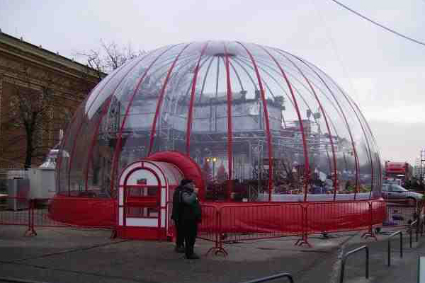
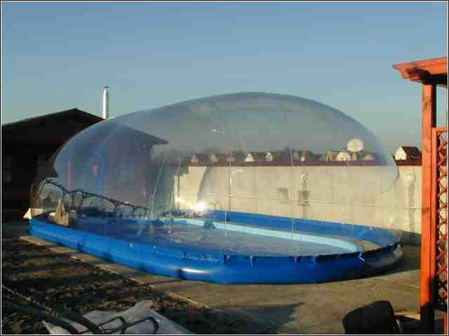

<!--
TODO:
* after removing the neptun code empty space remains at the place of input table

NOTES:
* Navigation panel would be great!
* kniting the whole page from pure markdown and r elements (r code snippets should not be changed)

-->

***

_Basic data/upload of results: <a href="submit.Rmd" target="_blank">link</a>._

_Deadline: 20/11/2015, Fri 12:00_

_Points are obtained provided that the hand-written solution has been submitted AND the results have been successfully uploaded $\left( {\Sigma 4{\rm{ pont}}} \right)$._

***

### Info
* Type your NEPTUN code (all CAPITALS) to ask for your basic data! After providing your NEPTUN code your parameters for each task will appear. (_The system may be tested by NEPTUN codes "PROBA1" and "PROBA2"._)
* Inform your consulting teacher if your NEPTUN code is missing from the system!
* Uploaded results with maximum +/- 1% deviation from the solution will be accepted (green coloured). 
* Apply sign-rule for reaction forces according to coordinate systems given for each task. For internal forces and moments use the following local system:

<div style="width:250px; height=200px">

</div>


```{r, echo=FALSE}
source("R/index/global.R")

# Neptun input
inputPanel(
  textInput("neptun", label = "Neptun", value = "")
)
```


```{r, echo=FALSE}
# # generate html file with solution for the given neptun code
# actionButton("show_solu", "Megoldas")
# 
# observeEvent(input$show_solu, {
#   rmarkdown::render("p1_solu_template.Rmd", output_file = paste("solution_html/p1_sol_", input$neptun, ".html", sep = ""),
#                   encoding = "UTF-8", quiet = T,
#                   params = list(stud_neptun = input$neptun))
#   }
# )
```

<!--
[Solutions](solu.Rmd) generated by any Neptun code.
-->

***

### 1. Task

Egy $F$ súlyú testet acélrudak tartanak úgy, hogy a rudak két végét egymástól $2 l$  távolságra rögzítjük. A test a két rögzítési ponttól egyenlő távolságra van. Mekkora a rúderő, ha terheletlen állapotban a rúd hossza $L_\rm{0}$? Mekkora a test függőleges eltolódása a rudak összenyomódása miatt? A rúd keresztmetszeti területe $A$, rugalmassági modulusa pedig $E = 200 kN/mm^\rm{2}$. <BR>
a.	Alkalmazza a kis elmozdulások elméletét!<BR>
b.	Alkalmazza a nagy elmozdulások elméletét! (3 lépésben)

<object type="image/svg+xml" data="image/3_hazi_1_feladat_1_abra_kiiras.png" 
style="width:335px;height:185px">Your browser does not support SVG</object>

```{r, echo=FALSE}
renderDataTable(in_datatable(prob_n = 1, input$neptun))
renderDataTable(req_datatable(prob_n = 1))
```

***

### 2. Feladat

Egy $a x b$ keresztmetszetű vasbeton oszlopban $4 \phi 20$ acélbetétet helyezünk el. Az oszlopot központos nyomóerő terheli. Határozza meg az oszlop keresztmetszetének teherbírását, ha a beton és az acél $\sigma - \epsilon$  diagramja az (a) ábra szerinti, illetve a (b) ábra szerinti!

<div style="width:660px; height=291px">

</div> 

<br>

<object type="image/svg+xml" data="image/3_hazi_2_feladat_2_abra_kiiras.png" 
style="width:875px;height:213px">Your browser does not support SVG</object>


```{r, echo=FALSE}
renderDataTable(in_datatable(prob_n = 2, input$neptun))
renderDataTable(req_datatable(prob_n = 2))
```

***

### 3. Feladat

Egy $h$ m mély munkagödröt levert (konzolos) I tartók közé elhelyezett pallózással biztosítanak. A földnyomás $p_\rm{1}$ - $p_\rm{2}$ $kN/m^\rm{2}$-ig változik lineárisan a magasság mentén. Az I keresztmetszet méretei: övek 100×5 mm, a gerinc 140×5 mm, az acél szilárdsága $f = 200 N/mm^\rm{2}$ , a nyírószilárdság pedig $90 N/mm^\rm{2}$ . Az I tartók egymástól mért távolsága $y$ m. 

(a) Megfelel-e az I tartó befogási keresztmetszete hajlításra? 
(b) Megfelel-e az I tartó befogási keresztmetszete nyírásra? 
(c) Mekkora az I tartók lehetséges legnagyobb egymástól mért távolsága?  (A feszültségeket közelítően számítsa!)

<table><tr><td>
<div style="width:550px; height=423px">

</div>

</td><td>
<object type="image/svg+xml" data="image/3_hazi_3_feladat_2_abra_kiiras.png" 
style="width:365px;height:369px">Your browser does not support SVG</object>
</table></tr></td>

```{r, echo=FALSE}
renderDataTable(in_datatable(prob_n = 3, input$neptun))
renderDataTable(req_datatable(prob_n = 3))
```

***

### 4. Feladat

Az előző feladatban adott munkagödör határolásnál milyen vastagságú pallózat felel meg az $y$ m-re elhelyezett I gerendák között, ha a fa szilárdsága $18 N/mm^\rm{2}$ ?


```{r, echo=FALSE}
renderDataTable(in_datatable(prob_n = 4, input$neptun))
renderDataTable(req_datatable(prob_n = 4))
```

***

### 5. Feladat

Az alábbiakban vizsgált épületet három merevítő elem merevít a mellékelt ábrán látható elrendezésben. Határozza meg az egyes merevítő elemekre ható terhek nagyságát! Adja meg, hogy az 1. fal alján milyen reakciókat kell egyensúlyozni! 

</td><td>
<object type="image/svg+xml" data="image/3_hazi_5_feladat_1_abra_kiiras.png" 
style="width:418px;height:269px">Your browser does not support SVG</object>
</table></tr></td>

```{r, echo=FALSE}
renderDataTable(in_datatable(prob_n = 5, input$neptun))
renderDataTable(req_datatable(prob_n = 5))
```

***

### 6. Feladat

Határozza meg az előző feladatban látható épület egyes merevítő elemeire ható terhek nagyságát, ha a szélteher iránya az ábrán jelöltre merőleges és nagysága $Q$! Adja meg, hogy az 1. fal alján milyen reakciókat kell egyensúlyozni!

```{r, echo=FALSE}
renderDataTable(in_datatable(prob_n = 6, input$neptun))
renderDataTable(req_datatable(prob_n = 6))
```

***

### 7. Feladat

Megengedhető-e az alábbi merevítőrendszer-elrendezés?

<object type="image/svg+xml" data="image/3_hazi_7_feladat_1_abra_kiiras.png" 
style="width:670px;height:137px">Your browser does not support SVG</object>


```{r, echo=FALSE}
renderDataTable(in_datatable(prob_n = 7, input$neptun))
renderDataTable(req_datatable(prob_n = 7))
```

***

### 8. Feladat

Egy gömbsüveg alakú fújt sátor alaprajzának sugara $R$, a gömb sugara $\rho$ , a falvastagság $t$, az anyagának szilárdsága $f$. Megfelel-e a sátor fala, ha a belső túlnyomás $p$?

<table><tr><td>
<div style="width:300px; height=200px">

</div>

</td><td>
<object type="image/svg+xml" data="image/3_hazi_8_feladat_2_abra_kiiras.png" 
style="width:286px;height:164px">Your browser does not support SVG</object>
</table></tr></td>

```{r, echo=FALSE}
renderDataTable(in_datatable(prob_n = 8, input$neptun))
renderDataTable(req_datatable(prob_n = 8))
```

***

### 9. Feladat

Mekkora az előző feladatban adott sátrat felemelni akaró erő? Mekkora és milyen irányú a peremgyűrűt terhelő erő, mekkora belső erő keletkezik a függőlegesen alátámasztott peremgyűrűben? 

```{r, echo=FALSE}
renderDataTable(in_datatable(prob_n = 9, input$neptun))
renderDataTable(req_datatable(prob_n = 9))
```

***

### 10. Feladat

Egy fújt sátor középen egy hengeres részből, a két végén egy-egy gömbszeletből áll. Az egyenes oldalak egymástól mért távolsága $D$, a henger sugara $\rho$, a falvastagság $t$. A belső túlnyomás $p$. Határozza meg a hengeres részen 

(a) a sátorban keletkező feszültségeket, 
(b) az egyenes peremgerendára ható erőket! 
(c) Elcsúszik-e az egyenes peremgerenda, ha vasbetonból készül, mérete $a x b$, és a talaj és a beton közti súrlódási tényező 0.5? 

<table><tr><td>
<div style="width:320px">

</div>

</td><td>
<object type="image/svg+xml" data="image/3_hazi_10_feladat_2_abra_kiiras.png" 
style="width:385px;height:187px">Your browser does not support SVG</object>
</table></tr></td>

```{r, echo=FALSE}
renderDataTable(in_datatable(prob_n = 10, input$neptun))
renderDataTable(req_datatable(prob_n = 10))
```
