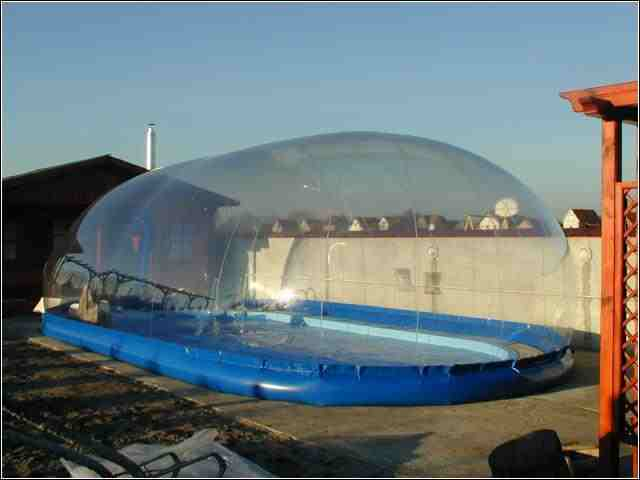

<!--
TODO:
* 

NOTES:
* 
-->

***


```{r, echo=FALSE}
library(dplyr, warn.conflicts = F)
source("R/get_compound_par.R")

load(file = "data/input_data.RData")

student_neptun   = params$stud_neptun ## WARNING!

input_data       = filter(input_data, Neptun == student_neptun)

compound         = get_compound_par(input_data)
comp_input_names = compound$names
comp_input_data  = compound$data

```

Neptun: `r params$stud_neptun`

***

### 10. Feladat

Egy fújt sátor középen egy hengeres részből, a két végén egy-egy gömbszeletből áll. Az egyenes oldalak egymástól mért távolsága $D$, a henger sugara $\rho$, a falvastagság $t$. A belső túlnyomás $p$. Határozza meg a hengeres részen 

(a) a sátorban keletkező feszültségeket, 
(b) az egyenes peremgerendára ható erőket! 
(c) Elcsúszik-e az egyenes peremgerenda, ha vasbetonból készül, mérete $a x b$, és a talaj és a beton közti súrlódási tényező 0.5? 

<table><tr><td>
<div style="width:320px">

</div>

</td><td>
<object type="image/svg+xml" data="image/3_hazi_10_feladat_2_abra_kiiras.png" 
style="width:385px;height:187px">Your browser does not support SVG</object>
</table></tr></td>


```{r, echo=FALSE}
  D = comp_input_data$p10__D
  rho = comp_input_data$p10__rho
  t = comp_input_data$p10__t
  p = comp_input_data$p10__p
  a = comp_input_data$p10__a
  b = comp_input_data$p10__b
  mu=0.5
  gamma_g=0.9
  gamma_vb=25
  
  sigma=p*rho/(1000*t)
  R=D/2
  
  F=p*R*2/10
  a=p*R
  alpha=asin(R/rho)
  N=a/sin(alpha)
  F_destab=N*cos(alpha)
  H_ny=R*F_destab
  
  F_vb=gamma_g*a*b*gamma_vb
  F_stab=mu*F_vb
  
```

Kiindulási adatok:

* $D =  `r D` \rm{m}$  
* $rho =  `r rho` \rm{m}$
* $t =  `r t` \rm{mm}$
* $p =  `r p` \rm{N/m^2}$
* $a =  `r a` \rm{mm}$
* $b =  `r b` \rm{mm}$
* $\mu=0.5$
* $\gamma_g=0.9$
* $\gamma_vb=25 \rm{kN/m^3}$

A sátor falában keletkező (húzó) feszültség a kazánképletből:

$$\sigma =\frac { p\times \varrho  }{ t \times 1000}=`r signif(sigma,3)`\rm{\frac { N }{ { mm }^{ 2 }}}. \quad \rm{(0.1 pont)}$$

</td><td>
<object type="image/svg+xml" data="image/3_hazi_10_feladat_1_abra_megoldas.png" 
style="width:580px;height:245px">Your browser does not support SVG</object>
</table></tr></td>

A sátrat terhelő nyomás függőleges eredője a nyomás felületmenti integrálásával nyerhető. Ez megegyezik a nyomás és az alapterület szorzatával. 

Így a fajlagos, 1 m-es hosszra jutó eredő, amely felemelni próbálja a sátrat:

$$F=\frac { p\times 2\times R  }{ 10 }   = `r signif(F,4)` \rm{ kN/m }.\quad \rm{(0.1 pont)}$$

A héj reakciójának a függőleges komponense a = N sin(alpha) . Ez ellensúlyozza a héjra ható p terhet. Mivel az a erő a 2L hosszon működik, a p teher pedig az 2RL felületen, a függőleges erők egyensúlya:

$$a\times 2\times L=2\times R\times L\times p $$

Ezt az egyenletet 2L-lel egyszerűsítve:

$$a=p\times R = `r signif(a/1000,4)` \rm{\frac { kN }{ m }}.  $$


A sátor érintőjének szöge a megtámasztásnál:

$$\alpha =\sin ^{ -1 }{ \left( \frac { R }{ \varrho  }  \right)  }=`r signif(alpha,3)`\rm{°}. $$

Az érintőirányú lekötő erő, amelynek ellentettje terheli a peremgyűrűt:

$$N=\frac { a }{ \sin { \alpha  }  } =`r signif(N,3)`\rm{\frac { kN }{ m }}.\quad \rm{(0.1 pont)} $$

A peremgerendát terhelő erő vízszintes komponense, amelynek ellentéte terheli a peremgerendát:

$$F_\rm{destab}=N\times \cos { \alpha  }=`r signif(F_destab,4)` \rm{\frac { kN }{ m }}.\quad \rm{(0.1 pont)}$$

A gerendában keletkező nyomóerő a kazánképletből:

$$H_\rm{ny}=  R\times F_\rm{destab}   =`r signif(H_ny,3)`\rm{\frac { kN }{ m }}.\quad \rm{(0.1 pont)} $$

A vasbeton peremgerenda súlya gátolja meg a sátor felemelkedését (a stabilizáló erő számításához a kisebbik parciális biztonsági tényezőt vettük figyelembe), ennek fajlagos nagysága:

$$F_\rm{vb}=\gamma_\rm{G} \times a\times b\times \gamma_\rm{vb} =`r signif(F_vb/1000000,4)` \rm{\frac { kN }{ m }}.$$

A súrlódási erő:

$$F_\rm{stab}= F_\rm{vb}\times \mu =`r signif(F_stab/1000000,4)` \rm{\frac { kN }{ m }}.\quad \rm{(0.1 pont)}$$

Amennyiben a destabilizáló erő nagyobb (F_destab > F_stab), mint a stabilizáló, akkor a peremgerenda elcsúszik.

