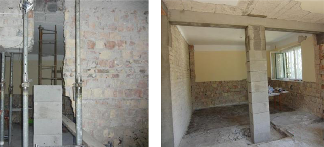

<!--
TODO:
* 

NOTES:
* 
-->

***

```{r, echo=FALSE}
library(dplyr, warn.conflicts = F)
source("R/get_compound_par.R")

load(file = "data/input_data.RData")

student_neptun   = params$stud_neptun ## WARNING!

input_data       = filter(input_data, Neptun == student_neptun)

compound         = get_compound_par(input_data)
comp_input_names = compound$names
comp_input_data  = compound$data

```

Neptun: `r params$stud_neptun`

***
### 2. Feladat

Egy $a x b$ keresztmetszetű vasbeton oszlopban $4 \phi 20$ acélbetétet helyezünk el. Az oszlopot központos nyomóerő terheli. Határozza meg az oszlop keresztmetszetének teherbírását, ha a beton és az acél $\sigma - \epsilon$  diagramja az (a) ábra szerinti, illetve a (b) ábra szerinti!


<div style="width:660px; height=291px">

</div> 

<br>

<object type="image/svg+xml" data="image/3_hazi_2_feladat_2_abra_kiiras.png" 
style="width:875px;height:213px">Your browser does not support SVG</object>


***

```{r, echo=FALSE}
a = comp_input_data$p2__F
b = comp_input_data$p2__h
phi = comp_input_data$p2__phi
sigma_c=20
sigma_s=500


A_c=a*b
A_s=4*phi^2*3.14/4

N_c=A_c*sigma_c
N_s=A_s*sigma_s

N_RA=N_c+N_s*2/5
N_RB=N_c+N_s

```

Kiindulási adatok:

* $a =  `r a` \rm{mm}$
* $b =  `r b` \rm{mm}$
* $\phi =  `r phi` \rm{mm}$
* $\sigma_c =  20 \rm{N/mm^2}$
* $\sigma_s =  500 \rm{N/mm^2}$

Az (a) ábrán vázolt $\sigma - \epsilon$ diagram esetén az acél húzásra és nyomásra egyaránt rugalmas-rideg, a beton csak nyomóerőt tud felvenni, a viselkedése rugalmas- rideg.
A beton keresztmetszeti területe (elhanyagolva az acélbetétek keresztmetszeti területe által elfoglalt helyeket):

$$A_\rm{c}=a\times b=`r signif(A_c,2)`\rm{ { mm }^{ 2 }} \quad .$$

Az acél keresztmetszeti területe:

$$A_\rm{s}=4\times \frac { { \phi }^{ 2 }\times \Pi  }{ 4 } =`r signif(A_s,3)`\rm{ { mm }^{ 2 }} \quad .$$

Ha csak beton lenne a keresztmetszetben, akkor a keresztmetszet teherbírása:

$$N_\rm{c}=A_\rm{c}\times \sigma_\rm{c} = `r signif(N_c/1000, 3)` \rm{kN}$$

Ha pedig csak a betonacél viselné a terhet, akkor:

$$N_\rm{s}=A_\rm{s}\times \sigma_\rm{s} = `r signif(N_s/1000, 3)` \rm{kN}$$

A beton és az acél össze van építve, „együttdolgoznak”, ezért a nyúlásuk meg kell, hogy egyezzen. Ezek szerint a keresztmetszet összenyomásánál először a beton megy tönkre, 1 ezrelék összenyomódásnál, ennél az értéknél a betonban fellépő erő Nc. 1 ezrelék összenyomódásnál az acélban csak $200 N/mm^\rm{2}$ feszültség alakul ki, vagyis a szilárdságának csak 2/5-öd része, így az acélokban fellépő erő Ns*2/5 lesz. A keresztmetszet teherbírása:

$$N_\rm{RA}=N_\rm{c}+N_\rm{s}\times \frac { 2 }{ 5 }  = `r signif(N_RA/1000, 3)` \rm{kN}.\quad \rm{(0.2 pont)}$$

A (b) ábrán vázolt $\sigma - \epsilon$ diagram esetén az acél húzásra és nyomásra egyaránt rugalmas-képlékeny, a beton csak nyomóerőt tud felvenni, a viselkedése rugalmas-képlékeny. Az 1 ezrelék összenyomódás eléréséig a vasbeton keresztmetszet ugyanúgy viselkedik, mint az (a) esetben. Ha tovább növeljük az összenyomódást, akkor a betonban a feszültség (és így az erő is) állandó marad. Az acélban nő a feszültség, amíg el nem érjük a 2,5 ezrelék összenyomódást. Ekkor a betonban és az acélban a szilárdságuknak megfelelő erő lép fel, amelynek értéke:

$$N_\rm{RB}=N_\rm{c}+N_\rm{s} = `r signif(N_RB/1000, 3)` \rm{kN}.\quad \rm{(0.2 pont)}$$

A keresztmetszet a 3 ezrelék elérésekor, a beton törésével megy tönkre.
